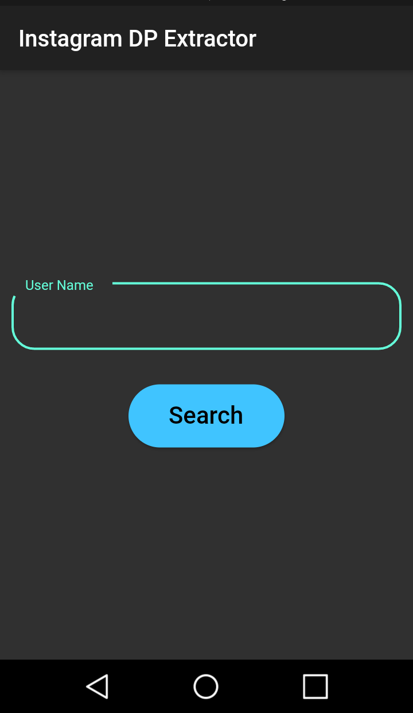
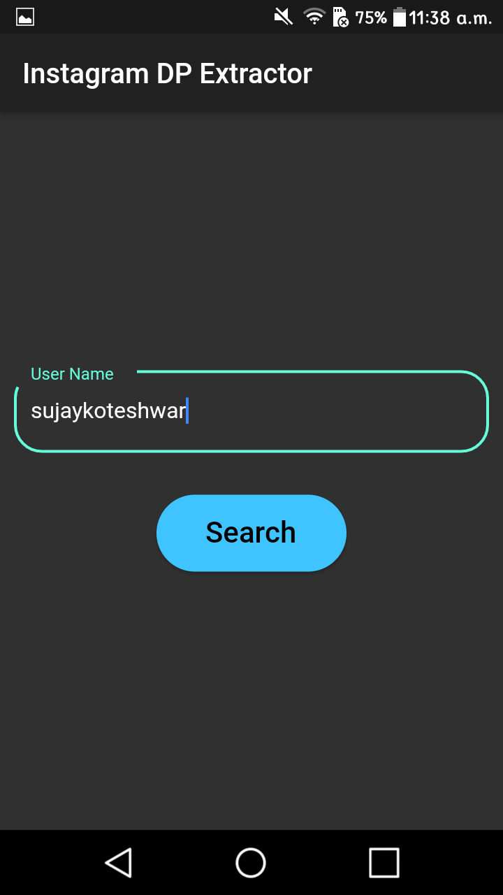

# instadp
# Flutter_insta_profile_saver
A basic flutter app to view and save the instagram user profile

  
   
  

                                                  
                                                  
 NOTE: 
Add the android.permission.INTERNET permission to AndroidManifest.xml file
if you are generating .apk file for release
otherwise it wont work due to lack of permission

